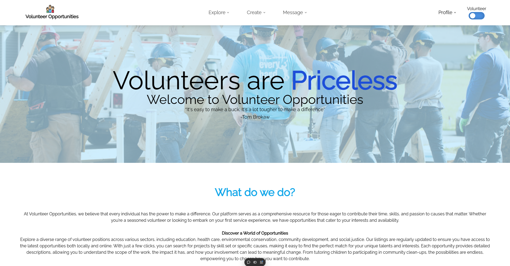

# Volunteer-Opportunities

Volunteer Opportunities is a website that aims to connect organizations and volunteers together so that they can work on the things that matter to them the most. Other websites don't offer a simple service dedicated to volunteering that allows users to easily connect with one another. Our website will present users with a feed of relevant organizations or volunteers that may me appropriate for the things they want to work on. Here we will present and explain our entire process, from start to finish, of creating this website designed to connect skilled volunteers with organizations who list volunteer opportunities and are in need of skilled labor.

Website: [Link](https://volunteer-opportunities.vercel.app/)

Team:

- Sebastian Newberry
- Ian Crowe-Sittig
- Parsa Nematollahe
- Loc Phan
- Jacob Ulbrich

Meetings: [Wiki](https://github.com/WSU-4110/Volunteer-Opportunities/wiki)

# Tech Stack

- Next.js [Docs](https://nextjs.org/docs)
- React.js [Docs](https://react.dev/reference/react)
- Tailwind CSS [Docs](https://tailwindcss.com/docs/installation)
- Pusher Websockets [Docs](https://pusher.com/docs/)
- Drizzle ORM [Docs](https://orm.drizzle.team/docs/overview)
- AWS S3 [Docs](https://docs.aws.amazon.com/s3/)
